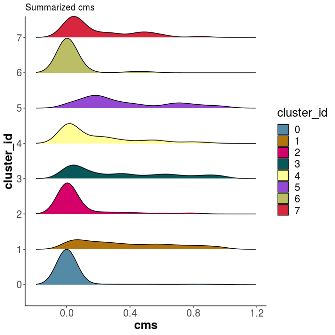
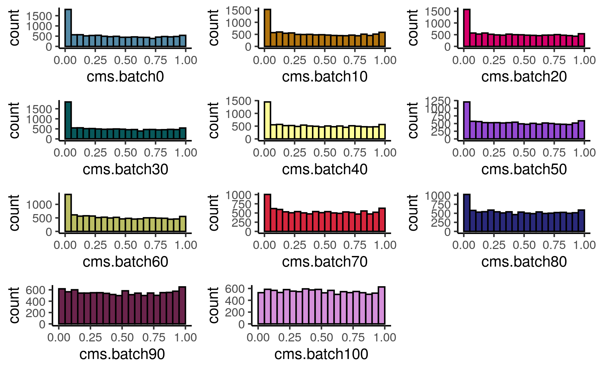

```{r, include=FALSE}
knitr::opts_chunk$set(echo = FALSE,
                      warning = FALSE,
                      tidy = FALSE,
                      message = FALSE,
                      fig.align = 'center',
                      out.width = "100%")
options(knitr.table.format = "html") 
```

# Introduction

Technological advances resulted in a rise of **single cell RNAseq (scRNA-seq)** data sets. 
As with other high-throughput technologies `batch effects` are a major challenge. In scRNA-seq analysis this is particular striking as major analysis steps (e.g. clustering) are not model dependent and a huge potential in this great ressource is in the `integration` of different data sets and modalities. 

```{r, include=FALSE}
knitr::write_bib(c('posterdown', 'rmarkdown','pagedown'), 'packages.bib')
```

## Objectives

1. Detection of batch effects and biases in scRNA-seq data.
2. Evaluation and comparison of data integration (e.g. after batch effect correction).

# Methods

**`Cellspecific Mixing Score (CMS)`**:   
A test for batch effects within k-nearest neighbours (knn):  
  
* independent of clustering  
* independet of batch compositions  

Tests for each cell the hypothesis that batch-specific distance distributions towards it’s knn cells are derived from the same unspecified underlying distribution using the _Anderson-Darling test_ [@Scholz1987].


**`Local density factor differences (ldfDiff)`**:   
A test for the data’s internal structure and variability preservation (removal of biological signal or random addition of a signal):  
  
* independent of clustering  
* comparable and interpretable  
   
Tests differences between each cell’s local density factor before and after data integration [@Latecki2007].


# Results

`Cellspecific mixing scores` of a distinct patient batch effect: 
Some celltypes form separated cluster per patient and others show one well mixed cluster. 
```{r batch_effect, echo=FALSE, out.width="70%"}
knitr::include_graphics("../figures/batch_pat.png")
``` 

Cellspecific mixing scores (cms) capture patient mixing. Celltypes that subcluster by patient get a score close to 0, while the cms increases with batch mixing.   

```{r cms_score, echo=FALSE, out.width="70%"}
knitr::include_graphics("../figures/cms_pat.png")
``` 

Differences between celltypes can not always be spotted as easily as above, but they get apparend when looking at the score distributions:

```{r cms_by_celltype, echo=FALSE, out.height="70%", out.width="80%"}

``` 

The `cellspecific mixing score` can be interpreted as the data’s probability within an equally mixed neighbourhood. Data with a batch bias show an accumulation of low p-values, while a randomly distributed batch variable results in a flat score (p-value) distribution. This can be shown by percentwise increasing the amount of randomly assigned batch label. The p-value histogram flatens with increased randomness in the batch variable. 

```{r hist, echo=FALSE, out.height="100%", out.width="100%"}

``` 


# Conclusion

CellMixS is a tool set to evaluate and visualize data integration and batch effects in single-cell RNA-seq data.

Main features:  

* **Quantify (batch-) mixing**:  
 
    + Cellspecific  
    + Neighbourhood adjustment (Unbalanced batches!)
    + Different metrics  
    
* **Quantify structual changes upon integration**:  
 
    + cellspecific  
    
* **Visualize mixing**:  

    + summarize and compare scores  

**cellMixS** is available as an __**Bioconductor**__ R package at `https://bioconductor.org/packages/release/bioc/html/CellMixS.html`.

```{r bioconductor, echo=FALSE, out.height="30%", out.width="30%"}
knitr::include_graphics("../figures/CellMixS.png")
``` 

# References
